# Отчет по выполненным задачам

## Part 1. Установка ОС
- Установлена Ubuntu 20.04 Server LTS без графического интерфейса с использованием UTM
- Проверка версии Ubuntu с помощью команды `cat /etc/issue`:  
Проверка версии Ubuntu.  
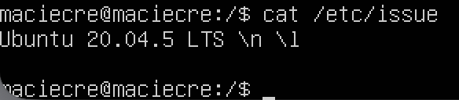

## Part 2. Создание пользователя
- Создан новый пользователь с добавлением в группу `adm`
- Выполнение команды создания пользователя `sudo adduser <name>`:  
Команда создания пользователя.  
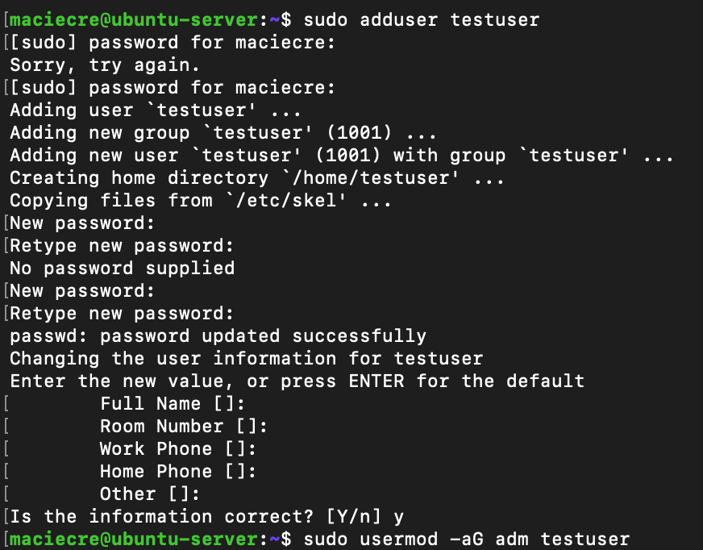
- Проверка наличия пользователя в системе `cat /etc/passwd`:  
Вывод команды.  
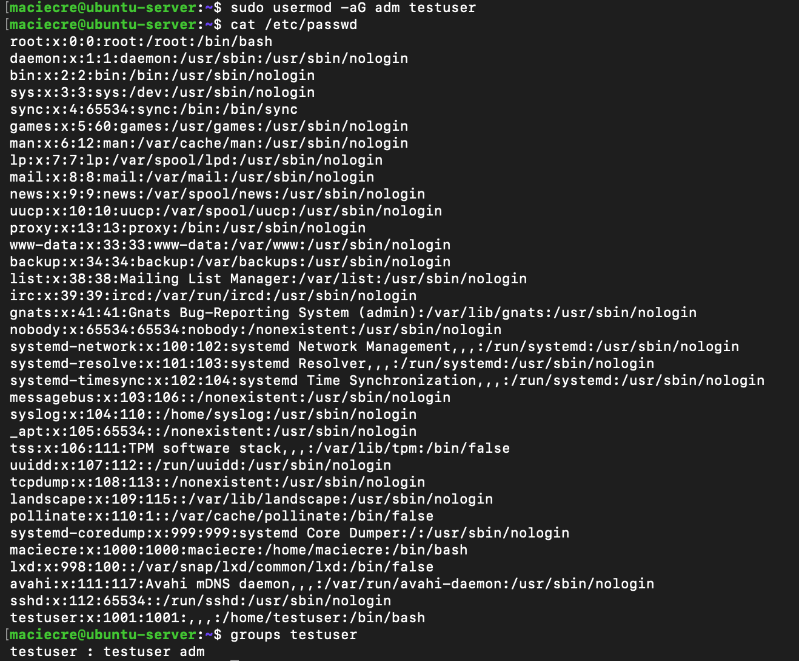

## Part 3. Настройка сети ОС

- Hostname изменен на user-1 с помощью `sudo hostnamectl set-hostname user-1`
- Временная зона установлена Europe/Moscow командой `sudo timedatectl set-timezone Europe/Moscow`
- Вывод сетевых интерфейсов `ip link show`
- Сетевые интерфейсы: lo (loopback) и enp0s1 (основной)
  
  **lo**: виртуальный сетевой интерфейс для локальных соединений внутри системы. Используется для тестирования сети, когда пакеты отправляются и принимаются на том же устройстве (IP-адрес 127.0.0.1).
- Получаем IP от DHCP  
  `ip a show enp0s1`
  
  **DHCP**: (Dynamic Host Configuration Protocol) - протокол для автоматической настройки сетевых параметров

- Внешний IP шлюза: `curl ifconfig.me`
- Внутренний IP шлюза: `ip route | grep default`
- Настроены статические параметры `/etc/netplan/00-installer-config.yaml`
- Применение настроек: `sudo netplan apply`
- Пинг удаленных хостов `ping -c 4 1.1.1.1` и `ping -c 4 ya.ru`.  
Пинг удаленных хостов.  
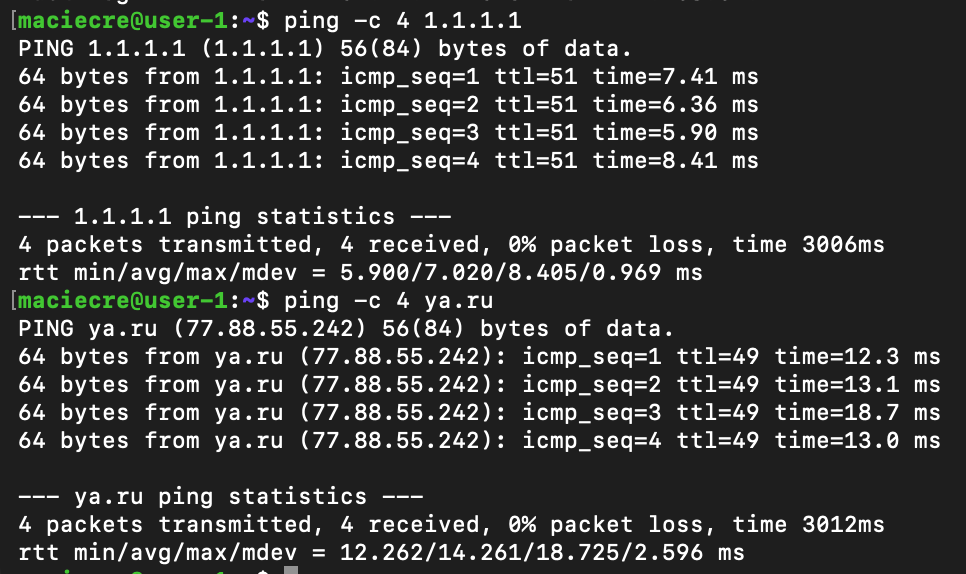

## Part 4. Обновление ОС
- Обновление пакетов, команды `sudo apt update` и `sudo apt upgrade`.  
Обновление пакетов.  
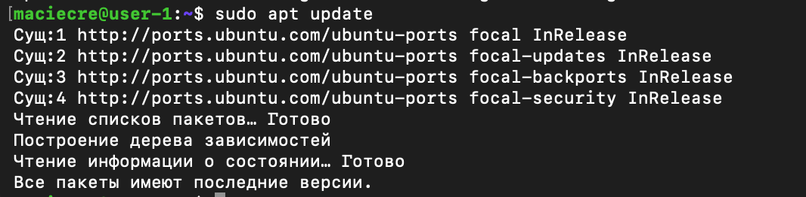

## Part 5. Использование команды sudo
- Добавляем `testuser` в sudo командой `sudo usermod -aG sudo testuser`
  
  sudo (superuser do) - команда для временного (до первой команды, если надо до выхода из системы флаг -i) предоставления прав суперпользователя

- Замена hostname, команда `sudo hostnamectl set-hostname testuser-pc`, проверка, команда `hostnamectl`, обновить терминал `bash`.  
Замена hostname:  
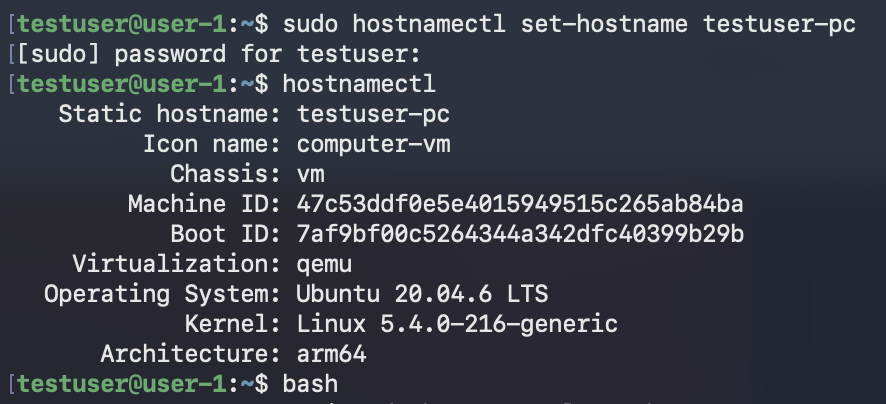

## Part 6. Установка и настройка службы времени
 - Вывод времени в котором нахожусь: `timedatectl`
 - Проверка синхронизации: `timedatectl show | grep NTPSynchronized`.  
 Проверка синхронизации.  
 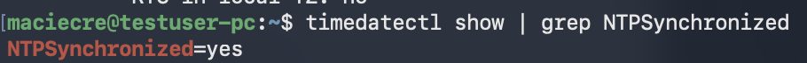

## Part 7. Установка и использование текстовых редакторов

- Проверяем стоят ли программы:  
`vim --version` - есть.  
`nano --version` - есть.  
`joe --version` - нет.  
`sudo apt install joe` - устанавливаем

- Part 7.1 Создал файл, написать ник, сохранить и выйти
  - VIM, `vim test_vim.txt`, сохранить и выйти: `esc, :wq, enter`.  
  Cкриншот перед выходом.  
  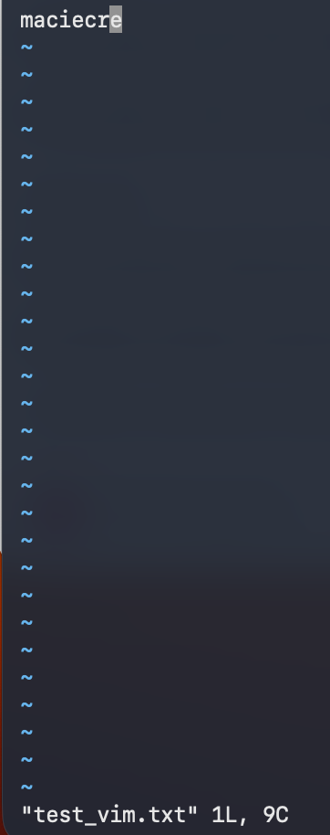
  - NANO, `nano test_nano.txt`, сохранить и выйти: `control + X, Y`.   
  Cкриншот перед выходом.   
  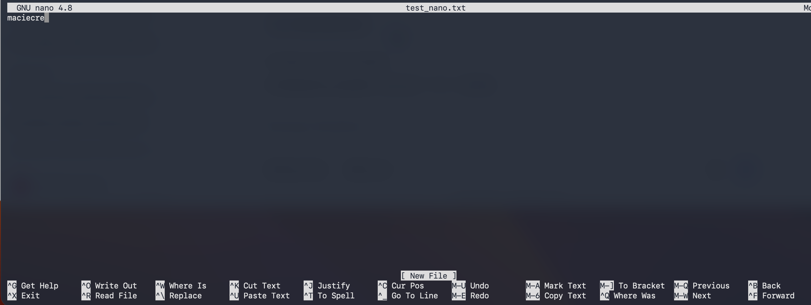
  
  - JOE, `joe test_joe.txt`, сохранить и выйти: `control + K, X`. 
  Cкриншот перед выходом. 
  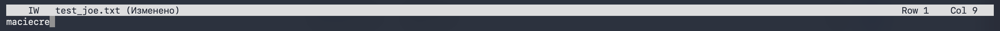
- Part 7.2 Открыть файл, изменить текст, выйти
  - VIM, `vim test_vim.txt`, выйти: `esc, :q!, enter`.  
  Cкриншот перед выходом.  
  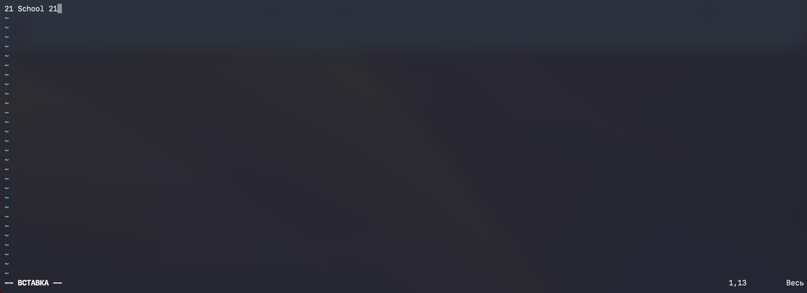

  - NANO, `nano test_nano.txt`, выйти: `control + X, Y`.  
  Cкриншот перед выходом.  
  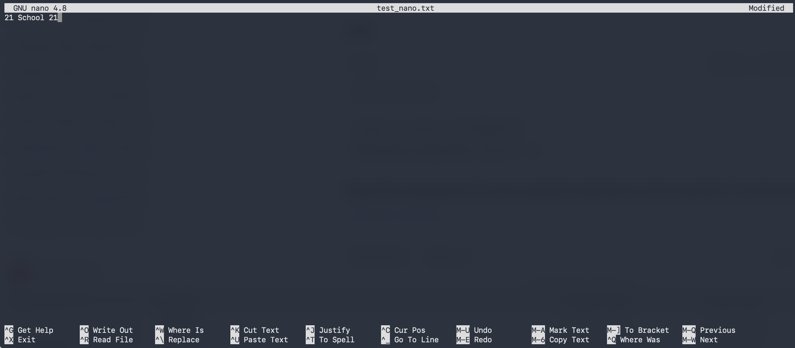

  - JOE, `joe test_joe.txt`, выйти: `control + C, Y`.  
  Cкриншот перед выходом.  
  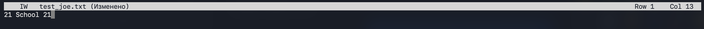
- Part 7.3 Открыть файл, изменить текст, выйти
  - VIM, `vim test_vim.txt`, поиск: `/School + Enter`.  
  Cкриншот.  
  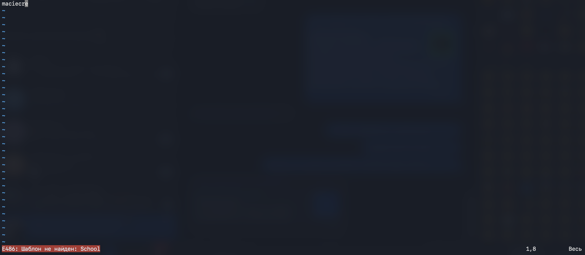
  - Замена: `%s/maciecre/21 School/g + Enter`.  
    Cкриншот.  
    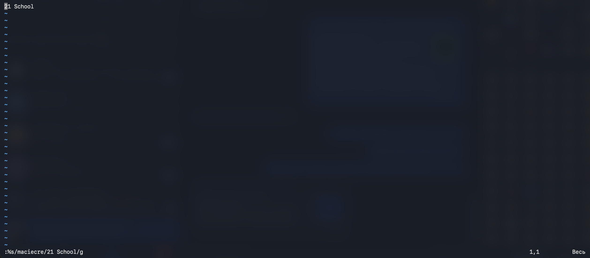

  - NANO, `nano test_nano.txt`, поиск: `Ctrl+W, School, Enter`.  
  Cкриншот.  
  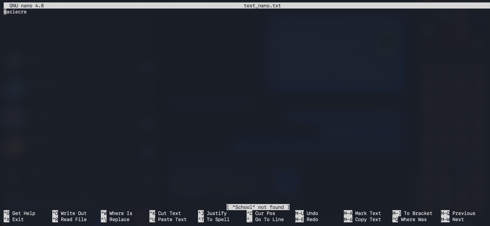. 
  - Замена: `Ctrl+\, maciecre, Enter, 21 School, Enter, A`.  
  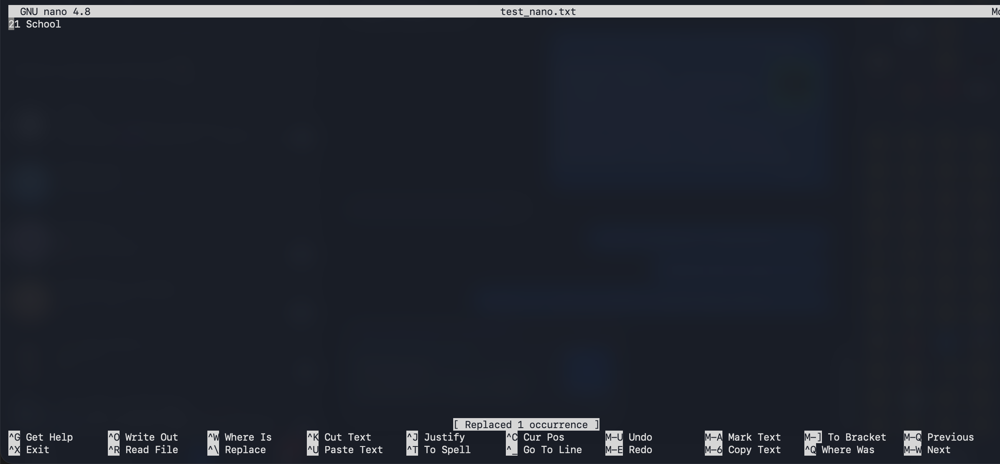

  - JOE, `joe test_joe.txt`, поиск: `Ctrl+K + F, School, Enter x2`.  
  Cкриншот.  
  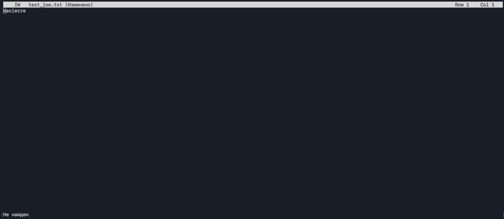  
  Замена: `Ctrl + k, f, maciecre, r, 21 School, enter, y, enter`.  
  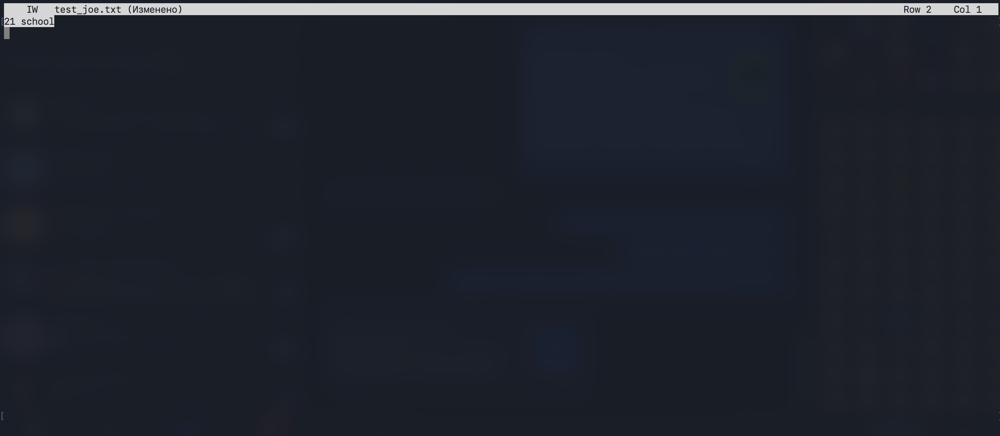 

## Part 8. Установка и базовая настройка сервиса SSHD

- SSH сервер уже был установлен `sudo systemctl status ssh`
- Автостарт уже был включен `sudo systemctl is-enabled ssh`
- Порт изменен с 22 на 2022 в файле `/etc/ssh/sshd_config`
- Служба перезапущена командой `sudo systemctl restart ssh`
- Процесс sshd активен:
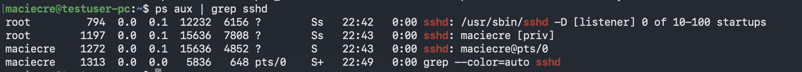
Команда `ps aux | grep sshd`
  - ps - команда для показа процессов. 
  - a - показать процессы всех пользователей.  
  - u - показать в user-ориентированном формате (с пользователем, CPU, памятью).  
  - x - включить процессы без терминала (фоновые службы).  
  - | grep sshd - отфильтровать вывод, оставив только строки с "sshd"
  - Три основных процесса SSH: 794 фоновый процесс-служба, привилегированный процесс для аутентификации 1197, 1272 сессия
- Система перезагружена: `sudo reboot`
- Проверка порта `netstat -tan | grep 2022`.  
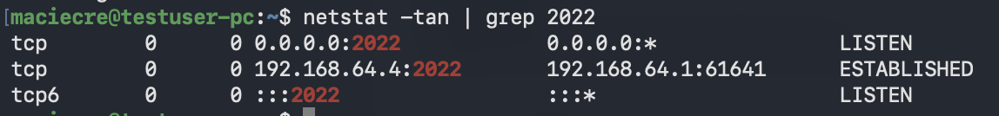
  - `-t` - TCP соединения
  - `-a` - все соединения (активные и слушающие)
  - `-n` - числовые адреса  
  Объяснение вывода:
  1. Протокол - tcp, tcp6
  2. Receive Queue (количество байт в очереди на получение ) - 0
  3. Send Queue (количество байт в очереди на отправку) - 0 
  4. Local Address - 0.0.0.0:2022, сервер слушает всех на протоколе IPv4 порт 2022, 192.168.64.4 установленное соединение порт 2022, :::2022 сервер слушает всех на протоколе IPv6 порт 2022
  5. Foreign Address - 0.0.0.0:* принимает подключения с любого адреса, порта, 192.168.64.1:61641 - подключение от IP 192.168.64.1 порт 61641
  6. State - LISTEN (ожидание подключения), ESTABLISHED (активное подключение)
  7. 0.0.0.0 - специальный IP-адрес который означает "все сетевые интерфейсы"

## 9.Установка и использование утилит top, htop
- первая строка:  
  - uptime - время, время работы системы
  - users - кол-во пользователей
  - load avarage - средня загрузка за 1, 5, 15 мин
- вторая строка:
  - Tasks - кол-во задач/процессов
  - запущенные/в режиме ожидания 
  - остановленные и выполненные, но еще в таблице  
- третья строка %Cpu(s):
  - us - время процессов пользователя
  - sy - время для системный процессов 
  - ni (запущены через nice) - время процессов с изменными приоритетами
  - id (idle) - простой процессора
  - wa (wait i/o) - ожидание операций io, например диск, сеть, usb устройства
  - hi (hardware interrupts) - время на аппаратные прерывания
  - si (software interrupts) - вермя на программные прерывания
  - st (steal time) - время украденное гипервизором, когда хост система забирает ресурсы у виртуалки
- MiB Mem - использование оперативной памяти (всего, свободной, используемой, буффер/кеш)
- MiB Swap - виртуальная память (всего файла подкачки, свободная, испл., доступная)
- pid процесса занимающего больше всего памяти, top по столбцу %MEM (клавиша `M`), например pid 1 systemmd
- pid процесса, занимающего больше всего процессорного времени, top по столбцу CPU (клавиша `P`),, 4449 top
- выход из top`q`
- скрин с выводом команды htop:
  - PID: 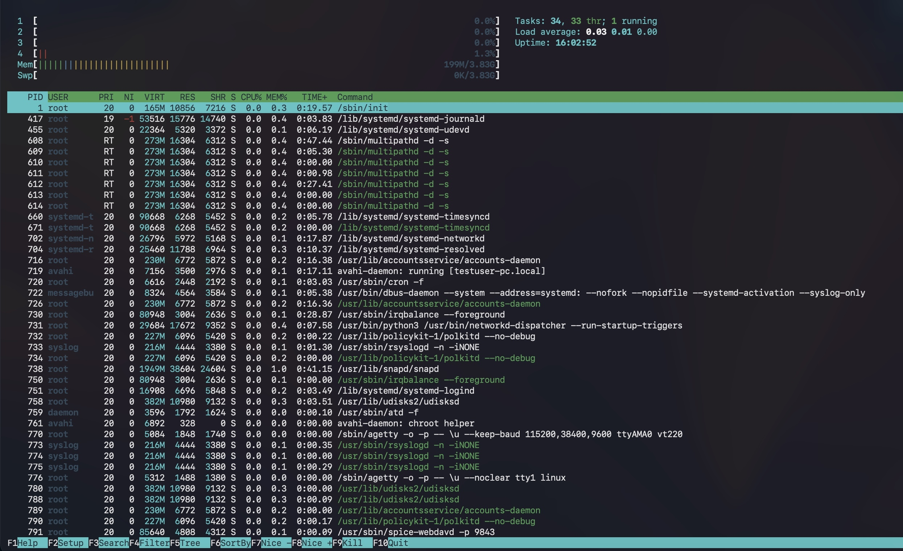
  - PERCENT_CPU: 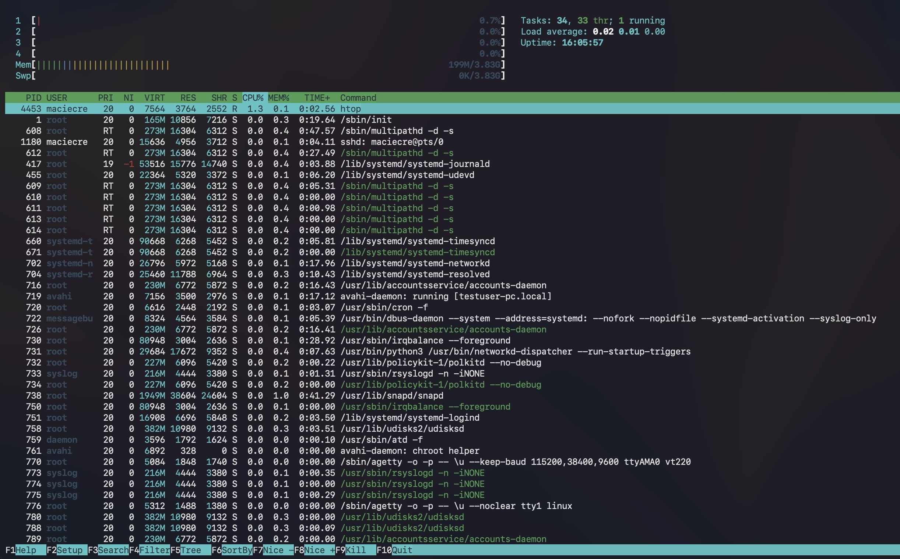
  - PERCENT_MEM: 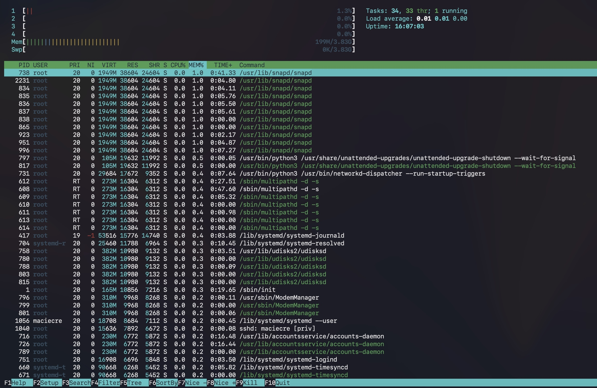
  - TIME: 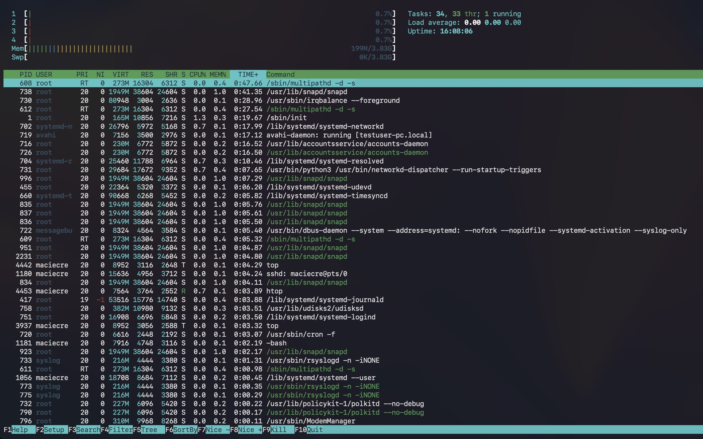
  - sshd (F4, sshd): 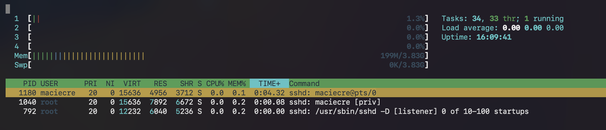
  - process syslog (F3, syslog): 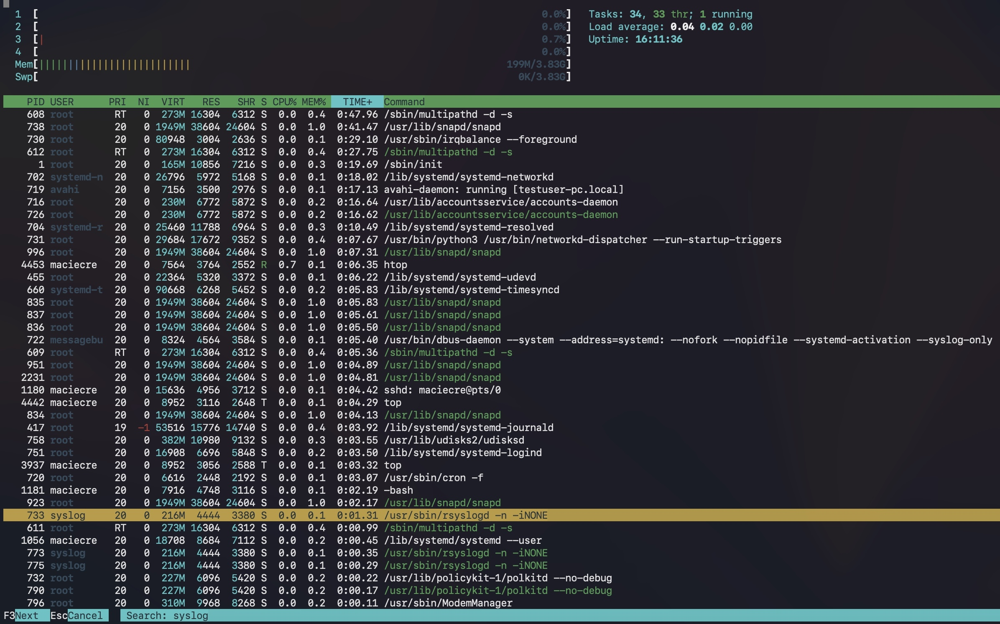
  - hostname, clock, uptime (F2, meters): 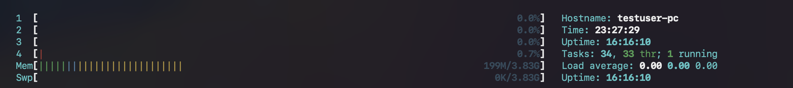

## Part 10. Использование утилиты fdisk
- Запущена команда `sudo fdisk -l`
- Жесткий диск: `Disk /dev/vda`
- Размер диска: `40 GiB`
- Количество секторов: `83886080`
- Размер swap: `3919 MiB` (виден в top, но не в fdisk)

## Part 11. Использование утилиты df (disk free + -Th (Type, human-readable))
- Корневой раздел: /dev/mapper/ubuntu--vg-ubuntu--lv (установлена Ubuntu)
  - размер раздела: 18889392 1K-блоков
  - Занятое пространство: 6973808 1K-блоков
  - Свободное пространство: 10930704 1K-блоков
  - Процент использования: 39%
  - Единица измерения: 1K-блоки (по 1024 байта)
- df -Th:
  - Размер раздела: 19G
  - Занятое пространство: 6,7G
  - Свободное пространство: 11G
  - Процент использования: 39%
  - Тип файловой системы: ext4 (стандартная файловая система для Linux)

## Part 12. Использование утилиты du (disk usage)

- Размер папок `/home, /var, /var/log`
  - Команда sudo `du -s  /home /var/log /var` -s - итоговый размер
  - Скриншот вывода в байтах: 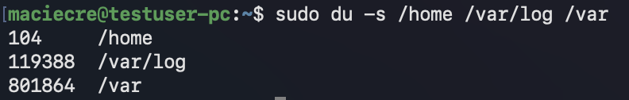
  - Скриншот вывода в человекочитаемом виде: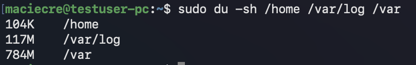
  - Содержимое в `/var/log`, `sudo du -sh /var/log/*` каждый элемент
  - Скриншот вывода: 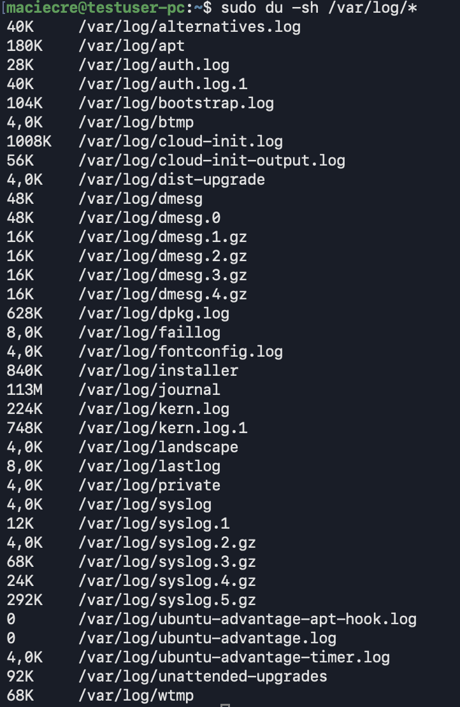

## Part 13. Установка и использование утилиты ncdu
- `sudo apt install ncdu`, press `f` for respect / `q` - exit 
  - Скриншот размер `ncdu /home`: 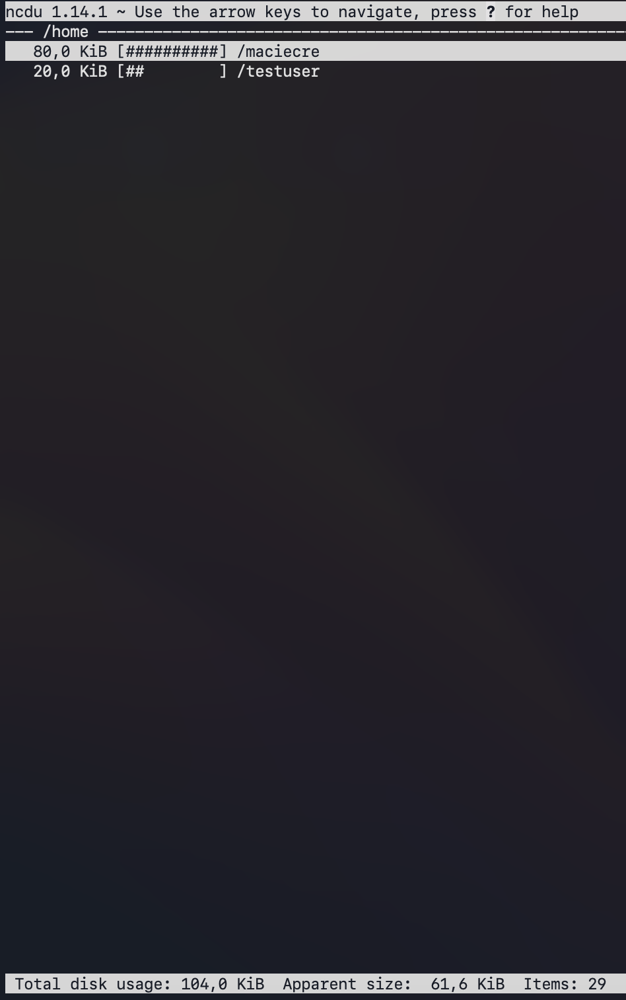
  - Скриншот размер `ncdu /var`: 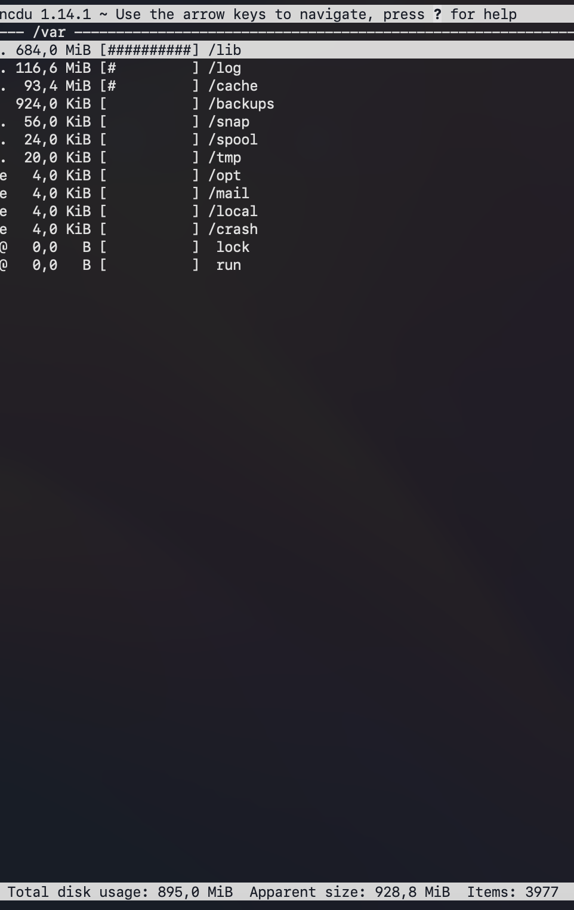
  - Скриншот размер `ncdu /var/log`: 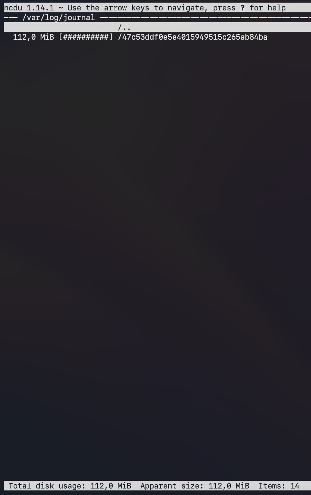

  ## Part 14. Работа с системными журналами
  - sudo `less /var/log/dmesg` - журнал загрузки системы
  - sudo `less /var/log/syslog` - основной системный журнал
  - sudo `less var/log/auth.log` (поиск авторизаций `sudo grep "sshd.*Accepted" /var/log/auth.log`) - журнал аутентификации 
  - Последняя авторизация Nov 25 23:07:02, имя maciecre, метод входа пароль
  - Рестарт SSHd: `sudo systemctl restart ssh` 
  - Cкриншот `sudo less /var/log/syslog` 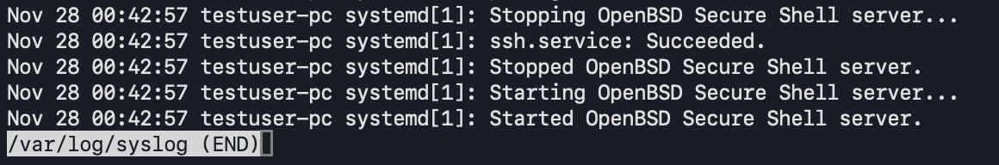

## Part 15. Использование планировщика заданий CRON
- Открывает CRON `crontab -e`
- Проверяем задания `crontab -l` 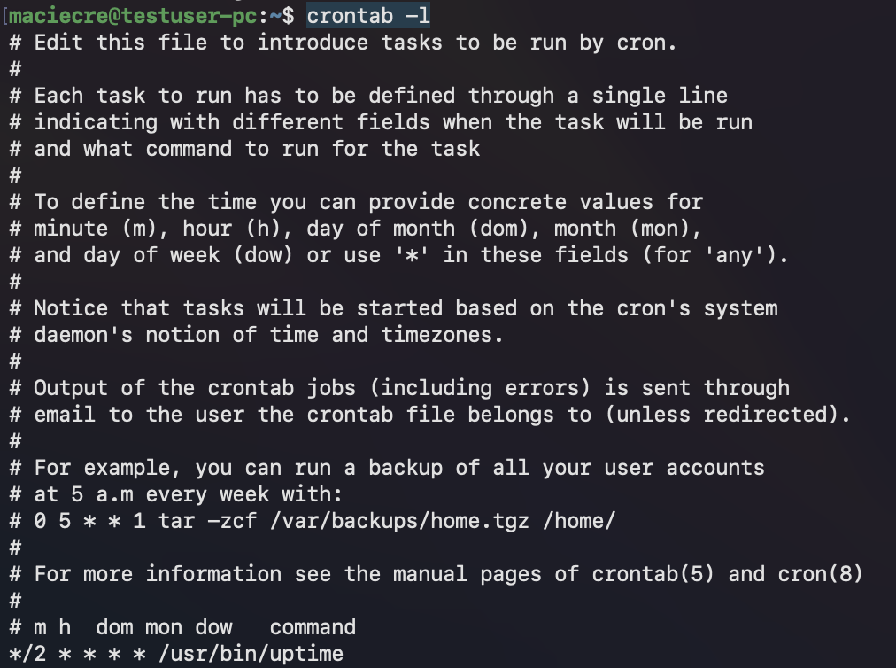
- Выполнение команд `sudo grep "CRON.*uptime" /var/log/syslog` 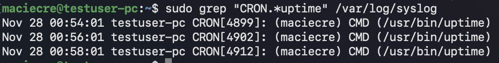
- Удаляем команду `crontab -r`
- Проверяем `crontab -l` 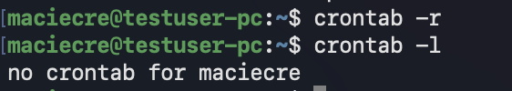
- Справочно, использовали команду `uptime` (системная утилита которая показывает текущее время, время работы системы, кол-во пользователей и среднюю загрузку в 1,5, 15 минут)
- Cинтаксис `*/2 * * * * /usr/bin/uptime`
  - */2 - каждые 2 минуты (значения 0-59)
  - *_и тд  каждый час (значения 0-23), каждый день (1-31), каждый месяц (1-12), каждый день недели (0-7, 0 и 7 - воскресенье, т.к. в разных странах разное начало недели)
  - /usr/bin/uptime - полный путь (гарантия что заработает)
- Флаги:
  - `-e` - edit
  - `-l` - list
  - `-r` - remove 
  - `grep "CRON.*uptime"` - поиск в логах
- Практическое применение CRON - резервное копирование, очистка файлов, отправка отчетов, мониторинг системы (uptime)

P.S. `sudo poweroff` / `sudo init 0` / `sudo shutdown -h +5` (через 5 мин)