# Report DO2_Linux Network

## Part 1. Инструмент ipcalc

### 1.1. Сети и маски
1) Адрес сети 192.167.38.54/13   
ipcalc 192.167.38.54/13  
Network:   192.160.0.0/13

2)  255.255.255.0  
Префиксная - /24 (8бит+8бит+8бит+0бит)  
Двоичная - 11111111.11111111.11111111.00000000  
/15  
обычная - 255.254.0.0  
двоичная - 11111111.11111110.00000000.00000000  
11111111.11111111.11111111.11110000  
обычная - 255.255.255.240   
префиксная - 28

3. 12.167.38.4  
/8: HostMin: 12.0.0.1 HostMax: 12.255.255.254  
/11111111.11111111.00000000.00000000 т.е /16: HostMin: 12.167.0.1 HostMax: 12.167.255.254  
/255.255.254.0 т.е. /23: HostMin: 12.167.38.1  HostMax: 12.167.39.254  
/4: HostMin: 0.0.0.1 HostMax: 15.255.255.254

### 1.2. localhost
к localhost можно обратиться только с адресов 127.x.x.x (диапазон 127.0.0.0/8).

194.34.23.100 - НЕТ (обычный публичный IP)  
127.0.0.2 - ДА (127.x.x.x)  
127.1.0.1 - ДА (127.x.x.x)  
128.0.0.1 - НЕТ (не 127.x.x.x)

### Диапазоны и сегменты сетей

3 диапазона частных IP (RFC 1918):  
10.0.0.0 - 10.255.255.255     (10.x.x.x)
172.16.0.0 - 172.31.255.255   (172.16-31.x.x)
192.168.0.0 - 192.168.255.255 (192.168.x.x).  

1. 10.0.0.45, 192.168.4.2, 172.20.250.4, 172.16.255.255, 10.10.10.10- частный.  
134.43.0.2, 172.0.2.1, 192.172.0.1, 172.68.0.2, 192.169.168.1 - публичный. 

2. Возможные IP-адреса шлюза для сети 10.10.0.0/18:
- 10.0.0.1 - НЕТ (не в сети 10.10.0.0/18)
- 10.10.0.2 - ДА (в диапазоне хостов 10.10.0.1–10.10.63.254)
- 10.10.10.10 - ДА (в диапазоне хостов 10.10.0.1–10.10.63.254)
- 10.10.100.1 - НЕТ (выходит за пределы сети /18)
- 10.10.1.255 - ДА (в диапазоне хостов 10.10.0.1–10.10.63.254)

## Part 2. Статическая маршрутизация между двумя машинами

Сетевые интерфейсы на ws1, ws2 на начало задания:  
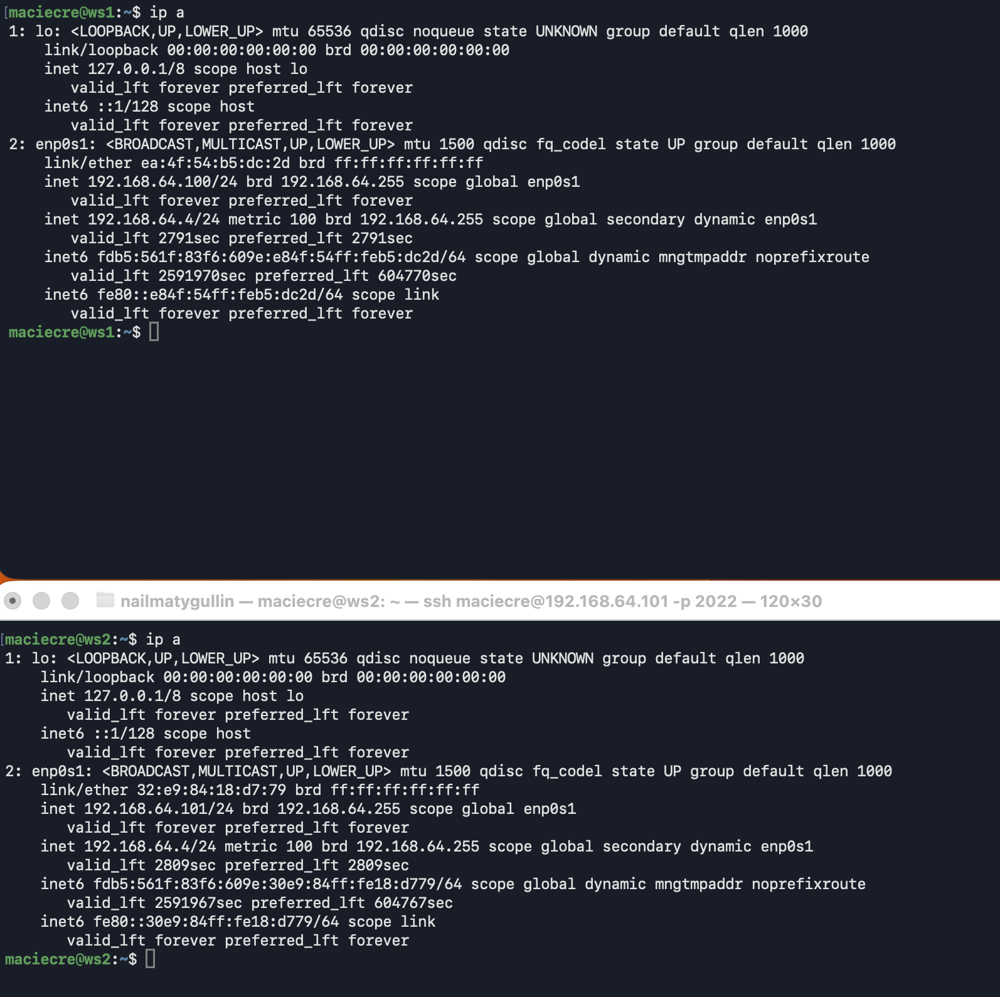
На машине ws1 сетевой интерфейс, соответствующий внутренней сети - enp0s1. На машине ws2 - enp0s1.

изменение ip адресов, применение настроек:
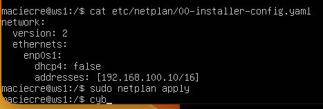
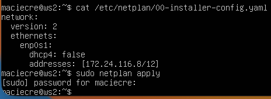

2.1. Добавление статического маршрута вручную sudo ip route add..
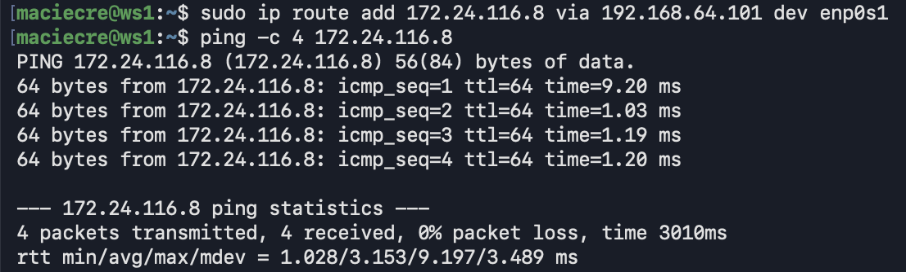
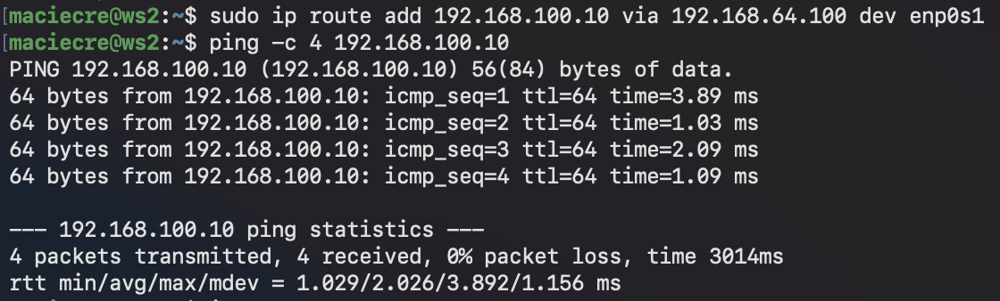

2.2. Добавление статического маршрута с сохранением
изменение файла /etc/netplan/00-installer-config.yaml
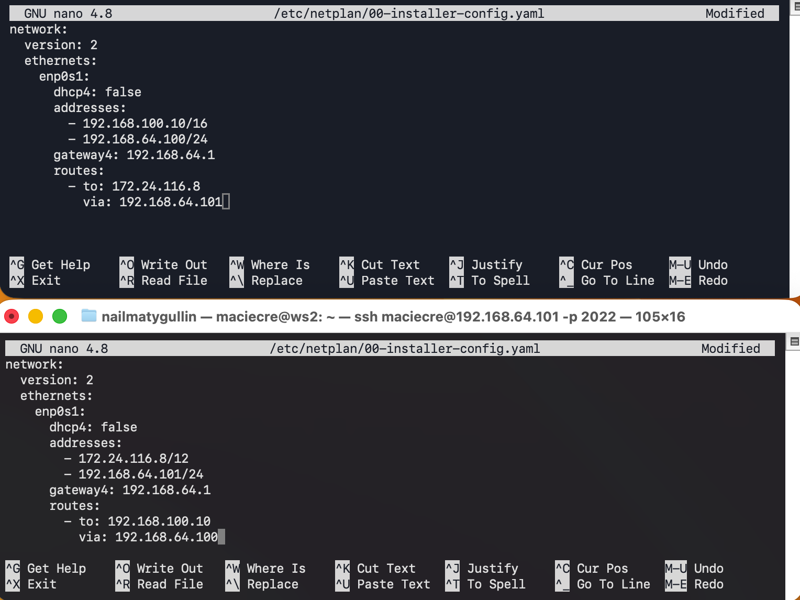
пинг
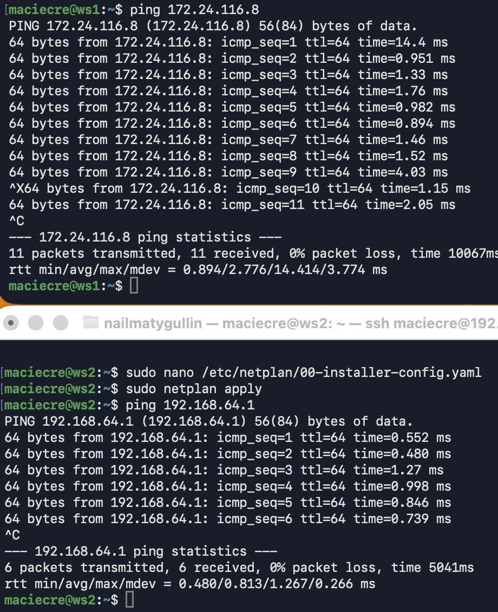

## Part 3. Утилита iperf3
3.1 Скорость соединения
1. 8 Mbps в MB/s.  
8 Mbps = 8 Мегабит в секунду.  
1 Байт = 8 бит.  
8 Mbps = 8 / 8 = 1 MB/s

2. 100 MB/s в Kbps.  
100 MB/s = 100 Мегабайт в секунду.  
1 Мегабайт = 1024 Килобайт = 8192 Килобит.  
100 MB/s = 100 * 8192 = 819,200 Kbps

3. 1 Gbps в Mbps.  
1 Gbps = 1000 Mbps

3.2. Утилита iperf3  
На ws1, ws2
``` 
sudo apt update
sudo apt install iperf3.  
``` 
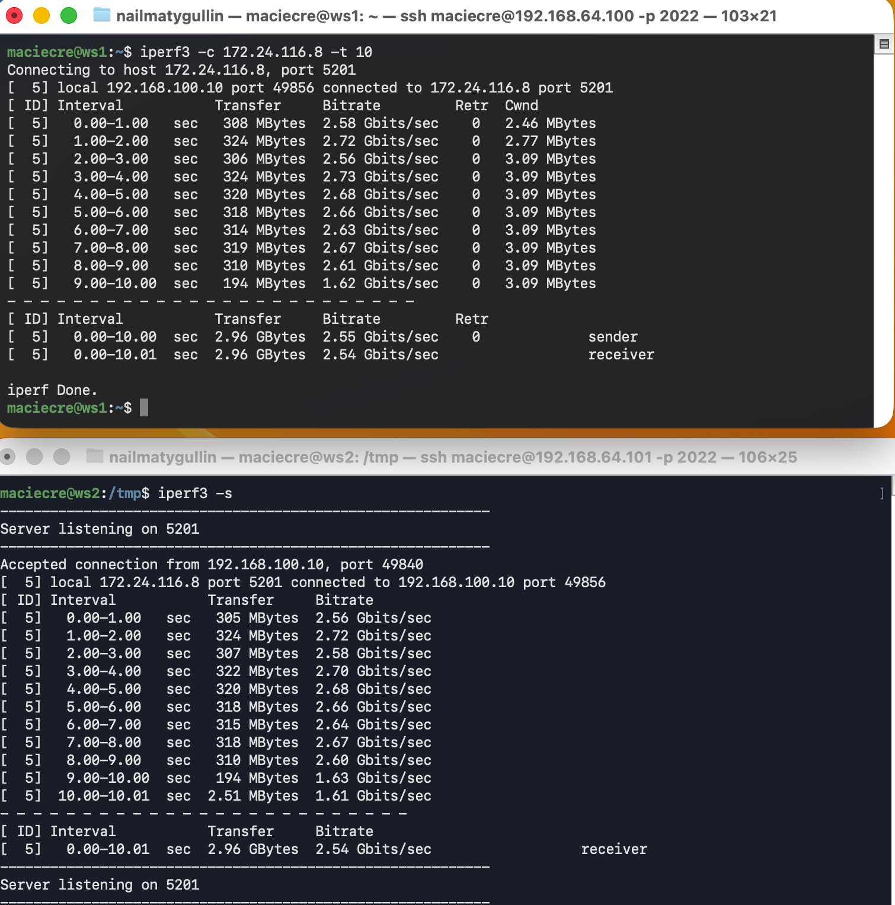

Результаты теста скорости соединения между ws1 и ws2:
- Средняя скорость передачи: 2.55 Гбит/с
- Объём переданных данных: 2.96 ГБ за 10 секунд
- Потерь пакетов: 0 (Retr = 0)

## Part 4. Сетевой экран

4.1. Утилита iptables
Содержанием файла /etc/firewall 
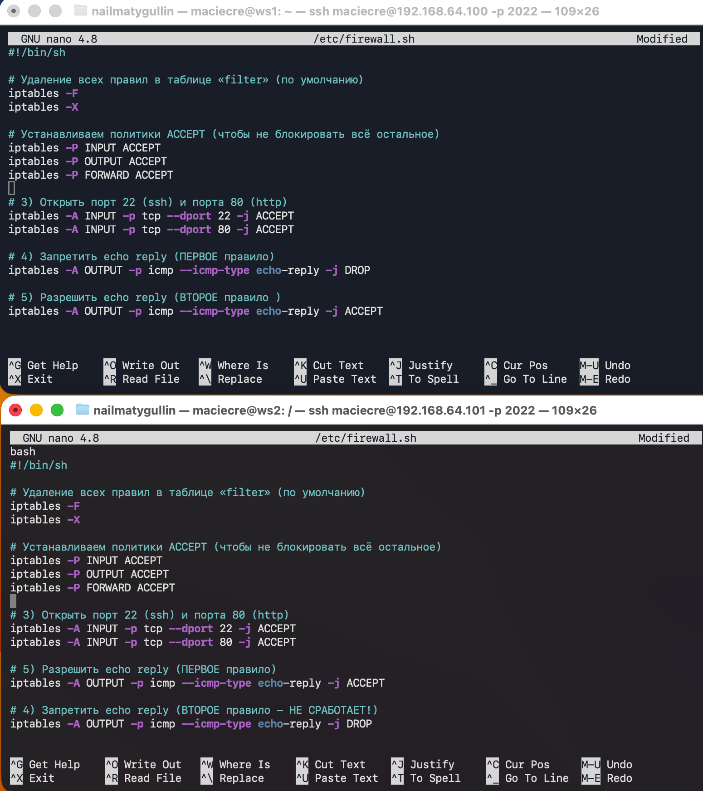

1. Создали файл скрипта командой `sudo nano /etc/firewall.sh`
2. Запуск `sudo /etc/firewall.sh`
3. Просмотр правил `sudo iptables -L -n -v (-l list, -n ip` адреса и порты в числовом формате, -v подробный отчет)
4.  Суть стратегий:
На машине WS1:
Применена стратегия «сначала запрет, потом разрешение».
В начале цепочки OUTPUT находится правило `DROP icmp --icmp-type echo-reply`
После него следует правило `ACCEPT icmp --icmp-type echo-reply`
На машине WS2:
Применена стратегия «сначала разрешение, потом запрет».
В начале цепочки OUTPUT находится правило `ACCEPT icmp --icmp-type echo-reply`
После него следует правило `DROP icmp --icmp-type echo-reply`
5. iptables обрабатывает правила последовательно сверху вниз. Если правило подходит — применяется указанное действие (ACCEPT/DROP) и дальнейшая проверка прекращается
6. Для WS1 (сначала запрет):
- Пакеты ICMP echo-reply (ответы на ping) находят совпадение с первым правилом DROP
- Действие DROP применяется немедленно 
- Второе правило ACCEPT никогда не достигается
- Результат: машина WS1 не отвечает на ping (100% потерь пакетов)

Для WS2 (сначала разрешение):
- Пакеты ICMP echo-reply находят совпадение с первым правилом ACCEPT
- Действие ACCEPT применяется немедленно
- Второе правило DROP никогда не достигается
- Результат: машина WS2 успешно отвечает на ping (0% потерь пакетов)

4.2 
1. Установка `apt install nmap -y` (флаг yes)
2. `ping -c 2 192.168.100.10` - первая машина не пингуется
3. `nmap -Pn 192.168.100.10` - проверяем хоста (Host is up)
4. 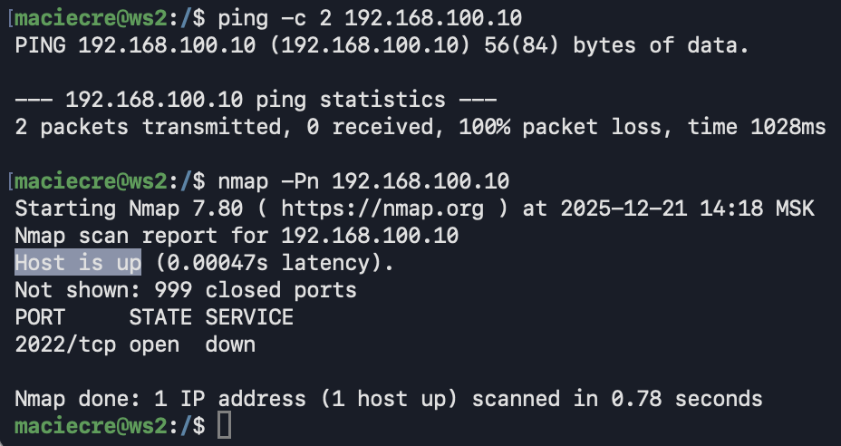
5. проверка портов `nmap -Pn -p 22 192.168.100.10`
`nmap -Pn -p 80 192.168.100.10`

## Part 5. Статическая маршрутизация сети

5.1. Настройка адресов машин  
Ws11
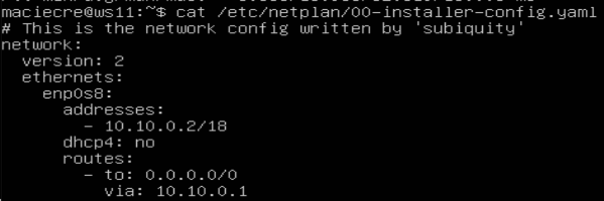
r1:
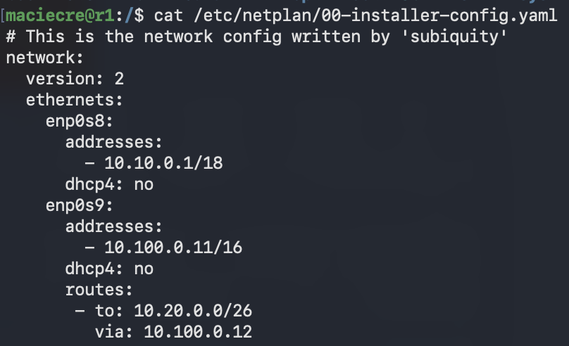
r2:
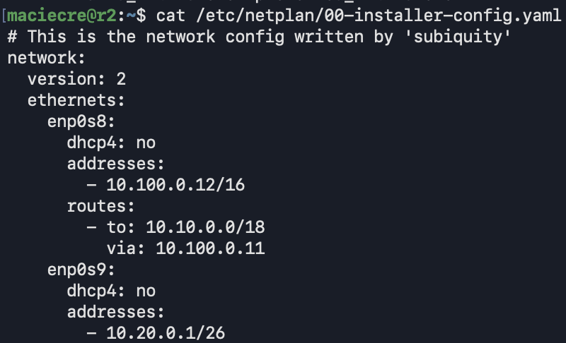
ws21:
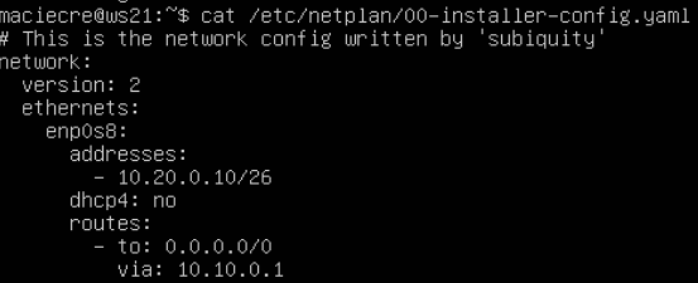
ws22:
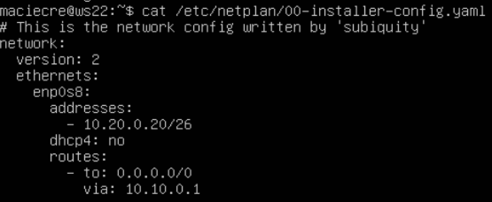

5.2. Включение переадресации IP-адресов  
Временное включение r1:
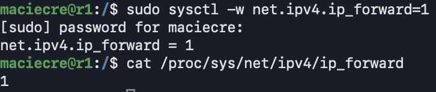
Временное включение r2:
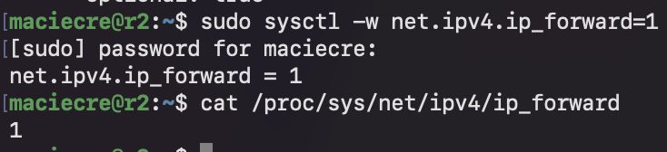
Постоянное включение r1:
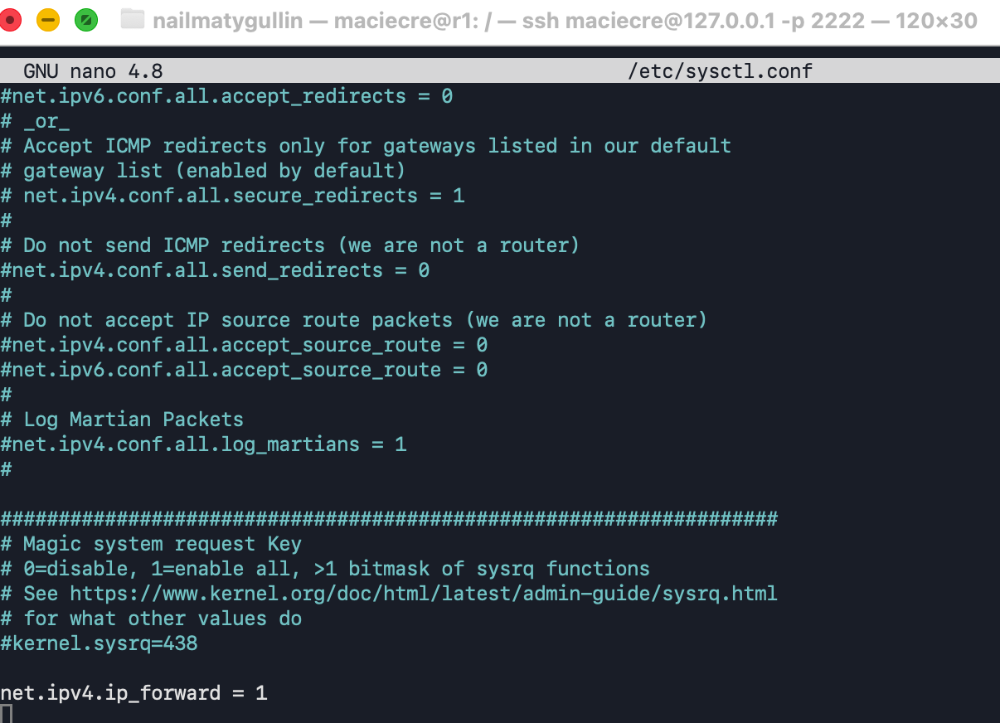
Постоянное включение r2:
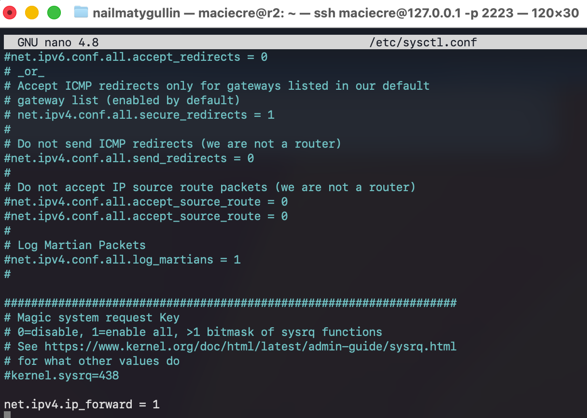

5.3 Установка маршрута по умолчанию
См. скриншоты etc/netplan/00-installer-config.yaml из пункта 5.1

Маршруты в таблице маршрутизации:
ws11:
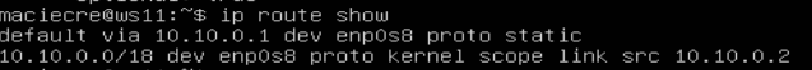

ws21:
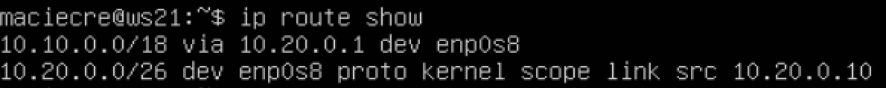

ws22:
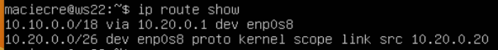

Gинг с ws11 роутер r2:
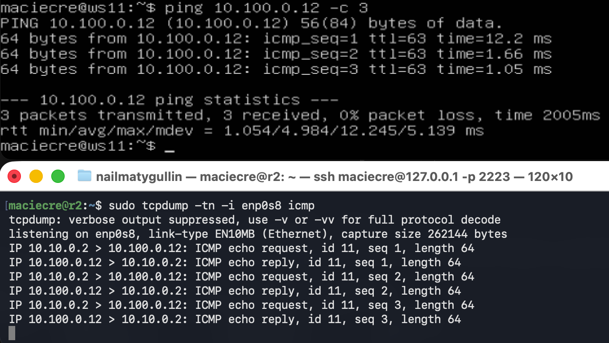

5.4. Добавление статических маршрутов
r1:

r2:


`ip route show` r1:
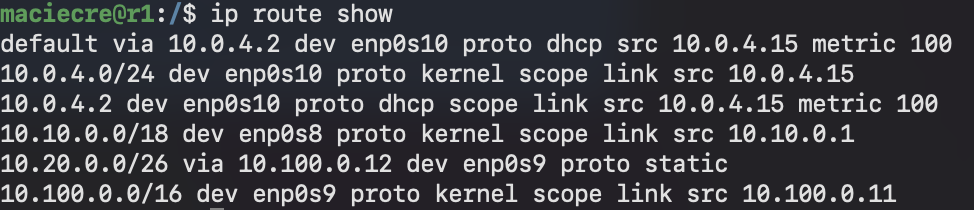

`ip route show` r2:
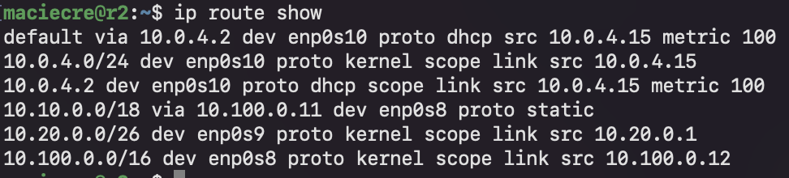

`ip r list` ws11:
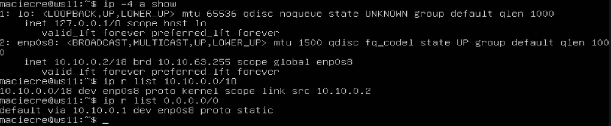

Вопрос: Почему для адреса 10.10.0.0/18 был выбран маршрут, отличный от 0.0.0.0/0, хотя он попадает под маршрут по умолчанию?

Ответ:
Маски подсети:  
/18 = 255.255.192.0 = первые 18 бит фиксированы  
/0 = 0.0.0.0 = нет фиксированных битов (подходит под всё)

Принцип Longest Prefix Match (наиболее специфичный маршрут): Когда ядро ищет маршрут для пакета, оно выбирает маршрут с самой длинной маской (наиболее специфичный).
Для пакетов в сеть 10.10.0.0/18 ядро выберет более специфичный маршрут (/18), а не общий default route (/0)

пример:
Представь две подсказки:  
"Это число от 1 до 1000" (очень общая)  
"Это число от 200 до 250" (более конкретная)  
Если правильный ответ — 225, какая подсказка лучше?

Обе подсказки верны (225 попадает в обе категории)  
Но вторая подсказка точнее, поэтому используем ее.


5.5. Построение списка маршрутизаторов  
на r1 `sudo tcpdump -tnv -i enp0s8 icmp`  
Флаги:
- t — не показывать timestamp
- n — не преобразовывать адреса в имена
- v — подробный вывод
- i enp0s8 — интерфейс к WS11

icmp — только ICMP пакеты (которые использует traceroute)

вывод терминалов:
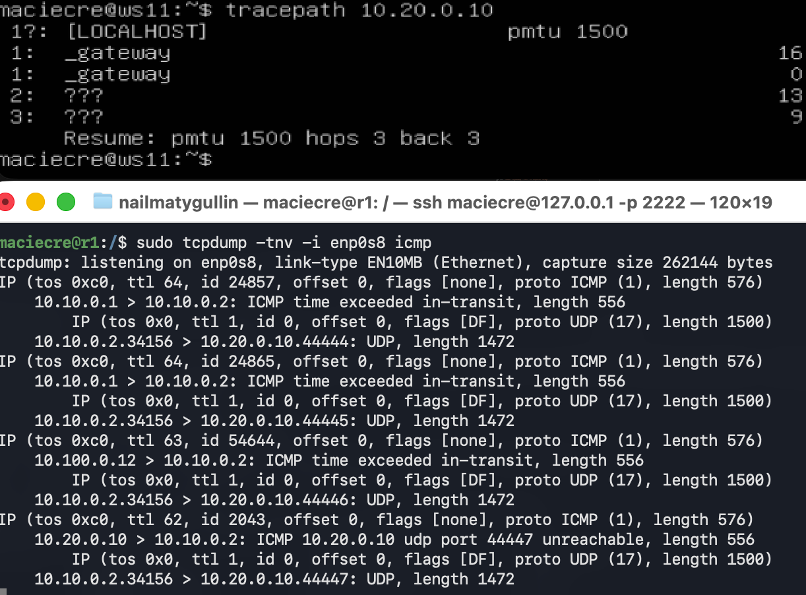

Вопрос: принцип работы построения пути при помощи traceroute.

Ответ: 
Вывод из tcpdump:

Первый пакет (TTL=1) дошёл только до R1 (10.10.0.1), который отправил ICMP "Time exceeded"

Второй пакет (TTL=1) подтвердил первый хоп

Третий пакет (TTL=2) прошёл через R1 и дошёл до R2 (10.100.0.12)

Четвёртый пакет (TTL=3) прошёл через R1 и R2, достиг WS21 (10.20.0.10)

Принцип работы traceroute: Утилита отправляет пакеты с увеличивающимся TTL. Каждый роутер уменьшает TTL на 1. Когда TTL достигает 0, роутер отбрасывает пакет и отправляет ICMP-ответ "Time exceeded". Анализируя эти ответы, traceroute строит путь до целевого хоста.

5.6. Использование протокола ICMP при маршрутизации

ws11 `ping -c 1 10.30.0.111` и вывод с r1 `sudo tcpdump -n -i enp0s8 icmp`
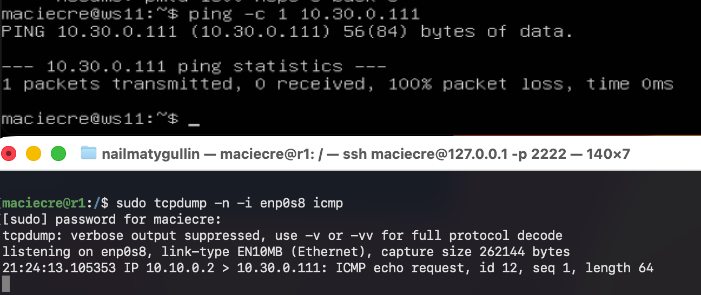

При ping несуществующего IP 10.30.0.111 видно, что пакет доходит до первого роутера (R1), но R1 не отправляет ICMP "Destination Net Unreachable". Это связано с тем, что у R1 есть маршрут по умолчанию, поэтому он пытается переслать пакет дальше, а не сообщать об ошибке. Пакет теряется где-то дальше в сети. При пинге с ws11 видно, что пакеты потерялись.

## Part 6. Динамическая настройка IP с помощью DHCP

6.1 
Aдрес маршрутизатора по умолчанию, DNS-сервер и адрес внутренней сети для r2 /etc/dhcp/dhcpd.conf:
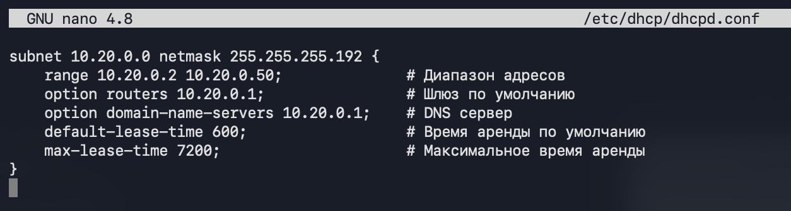 

r2 resolv.conf:
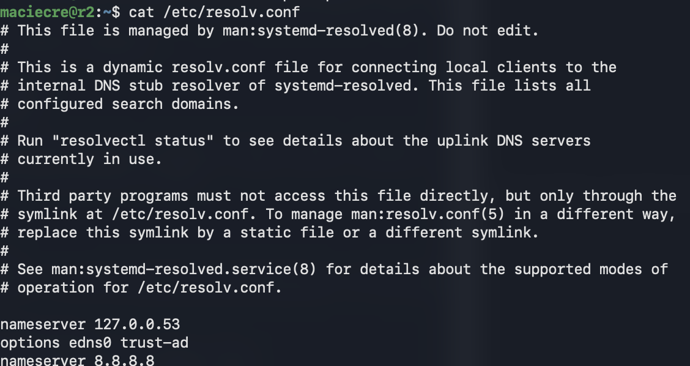 

ws21 ip, ping ws21-ws22:
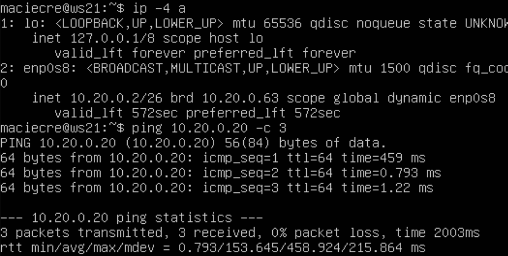 

ws11 etc/netplan/00-installer-config.yaml:
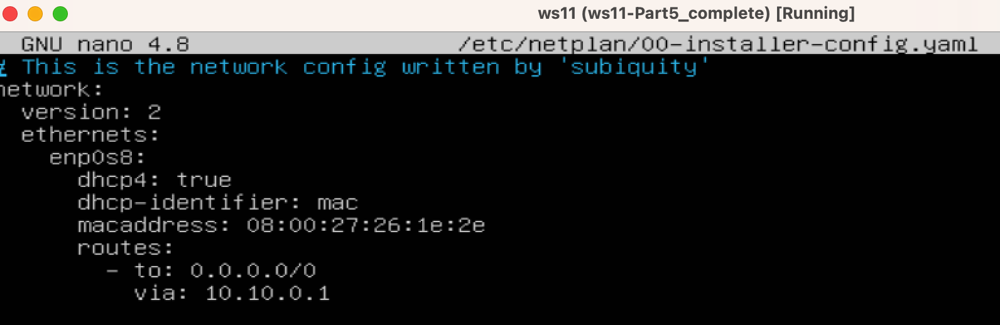 

r1 /etc/dhcp/dhcpd.conf:
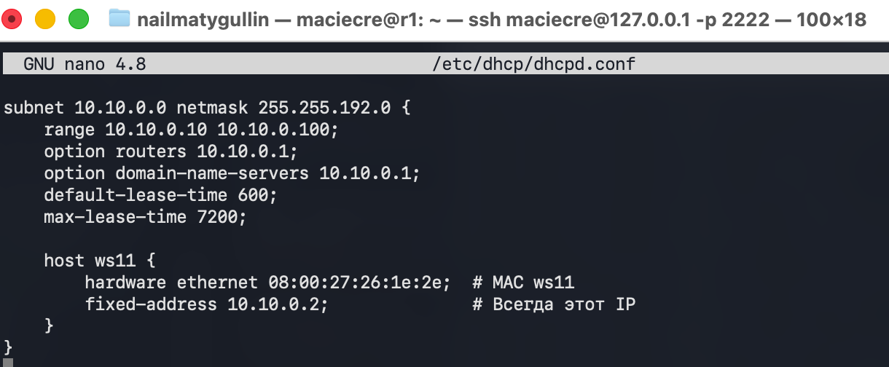 

Изменение ip на ws21:
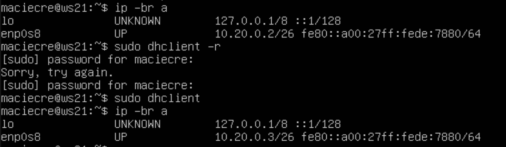 
использованный команды:  
`sudo dhclient -r` - (release) освобождает текущий арендованный IP-адрес и отправляет DHCP-серверу уведомление об освобождении.  
`sudo dhclient` - запрос нового ip
`ip -br a` - вывод ip   

## 7. NAT

`/etc/apache2/ports.conf` r1:
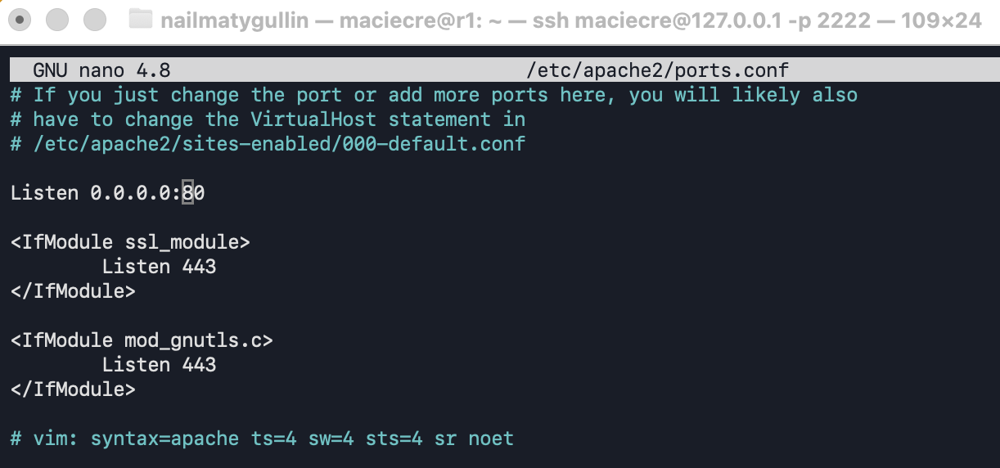 

`/etc/apache2/ports.conf` ws22:
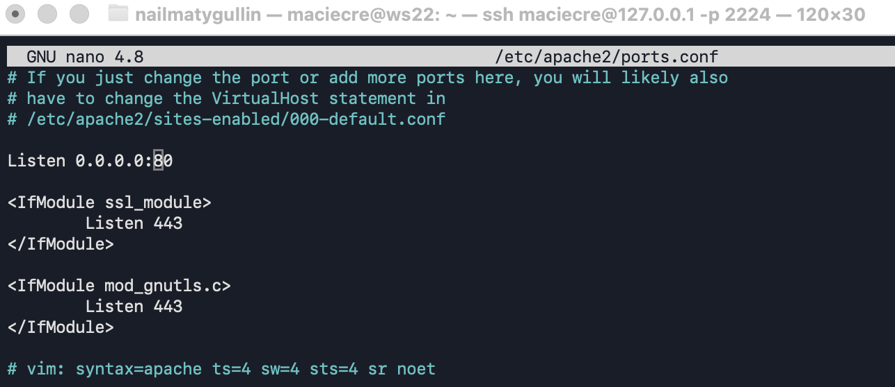 

Запуск apache на r1 и ws22:
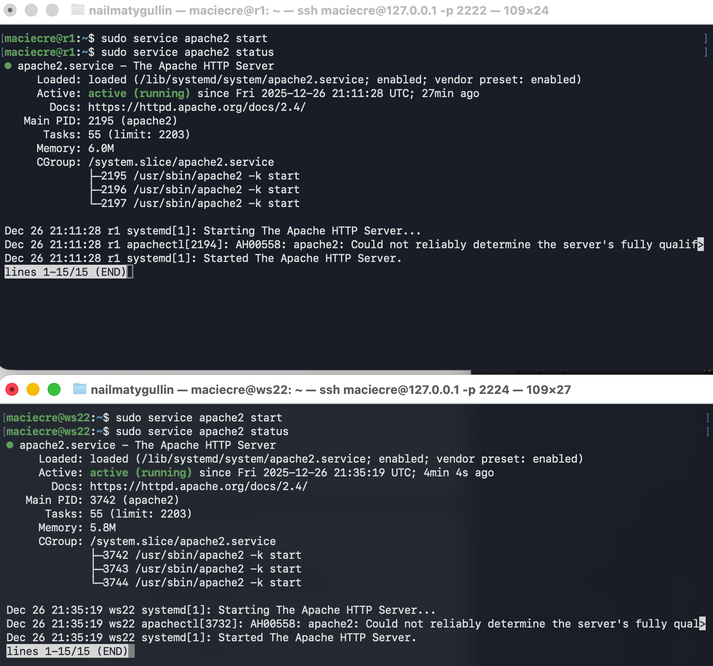 

Настраиваем firewall на r2:
1. `sudo nano /etc/firewall.sh`
2. Делаем исполняемым и запускаем  
`sudo chmod +x /etc/firewall.sh`  
`sudo /etc/firewall.sh`  

Пинг ws22 до r1:
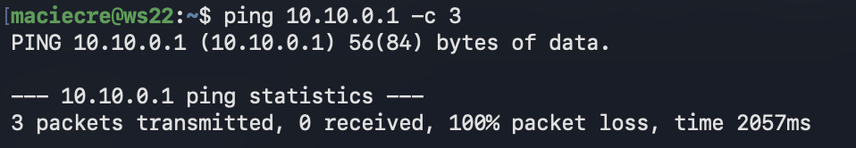 

добавляем `iptables -A FORWARD -p icmp -j ACCEPT`
Пинг ws22 до r1:
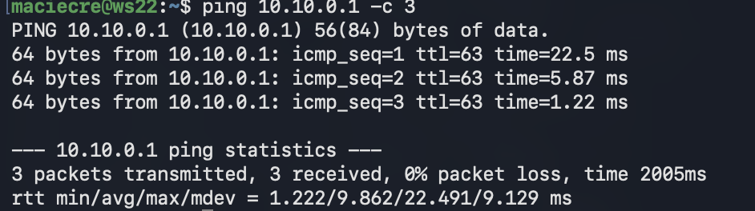 

добавляем прописываем snat + dnat  
`/etc/firewall.sh` на R2:
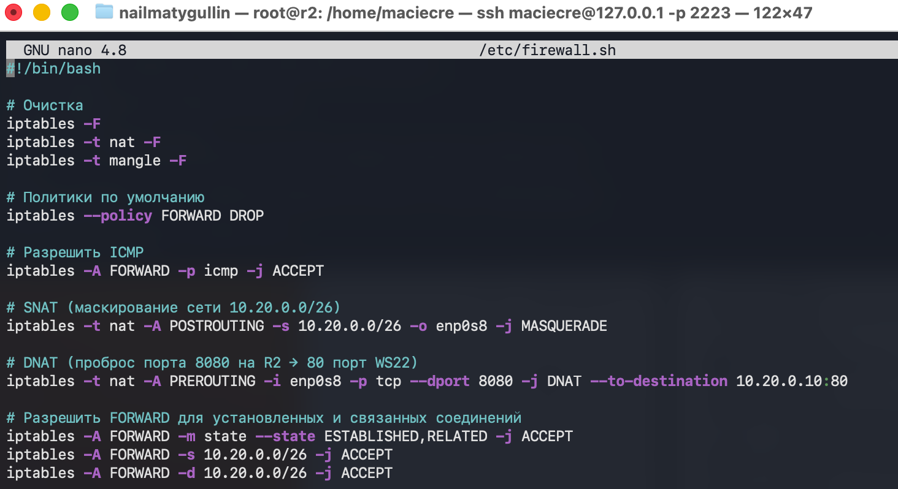 

Тест SNAT (ws22  r1 Apache):
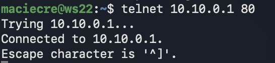 

Тест DNAT (r1  ws22 Apache):
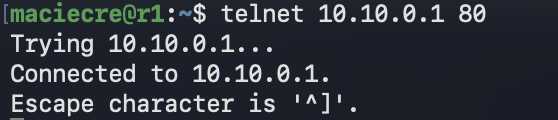 


## Part 8. Дополнительно. Знакомство с SSH Tunnels

На r2
`sudo nano /etc/firewall.sh` (Фаервол уже настроен и запущен, c 7 задания)

На ws22  
`sudo nano /etc/apache2/ports.conf` Изменить `Listen 80` на `Listen localhost:80`
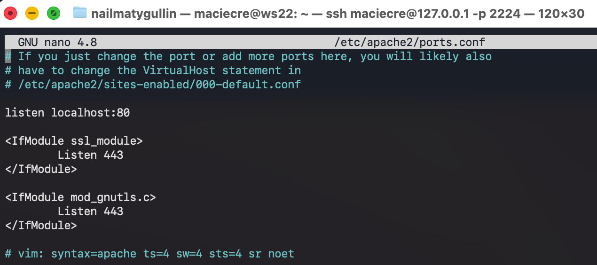 
Перезапускаем `sudo systemctl restart apache2`
Проверка `sudo ss -tlnp | grep :80`
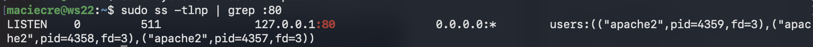 

На ws21  
`ssh -L 8080:localhost:80 maciecre@10.20.0.20 -N -f`
Проверка `telnet 127.0.0.1 8080`
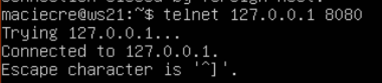 

Local Forwarding (ws21-ws22): SSH-клиент на ws21 создаёт туннель к ws22, пробрасывая локальный порт 8080 на localhost:80 ws22.

На ws22 (из-за особенностей маршрутизации и localhost-ограничения Apache)  
`ssh -R 0.0.0.0:8081:localhost:80 maciecre@10.100.0.12 -N -f`

Проверка на r2: `sudo ss -tlnp | grep :8081`  
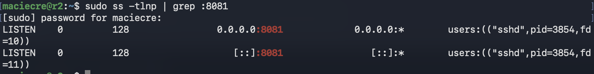 

Проверка `telnet 127.0.0.1 8081`
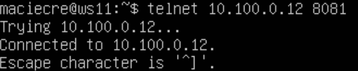 

Remote Forwarding (ws11-r2-ws22): Так как Apache на ws22 слушает только localhost:80, Remote Forwarding запускается с самой ws22 на r2 (порт 8081), откуда доступен с ws11.